<p align="center">
  <picture>
    <source media="(prefers-color-scheme: dark)" srcset="assets/hoocode.svg">
    
  </picture>
</p>

<p align="center">Deterministic terminal coding agent.</p>

<p align="center">
  
</p>

## Why HooCode?

Most coding agents act first and tell you later. HooCode works the other way around. It's *deterministic*: every edit and every shell command passes through a permission gate you control, and the agent is scoped by an explicit mode instead of one do-everything prompt.

| | HooCode | Typical AI editor |
|---|---|---|
| **Approval gates** | `Yes (once) / No (block) / Always` on every edit and command | Edits and commands apply on their own |
| **Mode-driven focus** | Ask · Plan · Build · Debug — each with its own prompt and tool set | One chat does everything |
| **Provider flexibility** | 25+ providers; switch with `--provider` / `--model` | Locked to one vendor |
| **Extensibility** | MCP servers, TypeScript extensions, per-project profiles | Closed plugin system |
| **Binary distribution** | Single self-contained binary, no Node.js at runtime | Requires an IDE or cloud account |

## How it works

Four modes, switched any time with `/mode <name>`:

1. **ask** — read-only Q&A. The agent explains, never writes.
2. **plan** — explores the repo and writes `.hoocode/plan.md` for you to review.
3. **build** — executes the approved plan, gating each edit and command.
4. **debug** — root-causes a failure without touching files.

```bash
hoocode               # start in build mode
hoocode /mode plan    # or draft a plan first
hoocode /approve      # review .hoocode/plan.md, then execute it
```

## Tools

The agent works through a small, deterministic tool set. Available by default:

| Tool | What it does |
|---|---|
| `read` · `write` · `edit` | Read files, create new ones, and make exact-text edits. One `edit` call can apply several replacements at once, and an edit can set `replaceAll` to replace every occurrence instead of requiring a unique match. |
| `bash` | Run shell commands — each one gated by the `Yes / No / Always` permission prompt. |
| `grep` · `find` · `ls` | Search file contents (ripgrep), find files by glob (fd), and list directories. `grep`/`find` respect `.gitignore`; `ls` lists a single directory and takes an optional `ignore` list to skip noise like `node_modules`. |

When running interactively, the agent can also ask you to make a decision through a multiple-choice prompt when it genuinely needs your input to proceed. In non-interactive (`-p`) runs it falls back to proceeding on its own.

Two extra tools are **off by default** — turn them on per session with a flag, or persistently in settings:

| Tool | Enable | What it does |
|---|---|---|
| **Task** (subagents) | `--enable-subagents` or `"enableSubagent": true` | Delegate a self-contained task to a specialized agent that runs in its own isolated context and returns only its final answer. |
| **TodoWrite** | `--enable-todowrite` or `"enableTodoWrite": true` | Maintain a live todo list for the current task, shown in the task panel. |

## Credits

HooCode is a fork of the upstream [`pi-mono`](https://github.com/earendil-works/pi-mono) project (originally [`badlogic/pi-mono`](https://github.com/badlogic/pi-mono)) by **Mario Zechner** ([@badlogicgames](https://github.com/badlogic)). The upstream project is MIT-licensed and all original copyright is preserved in [LICENSE](LICENSE). Huge thanks to Mario and the upstream contributors — without their work, this fork would not exist.

## Packages

| Package | Description |
|---------|-------------|
| **[@kolisachint/hoocode-agent](packages/coding-agent)** | Interactive coding agent CLI (`hoocode` / `hoo`) |
| **[@kolisachint/hoocode-agent-core](packages/agent)** | Agent runtime with tool calling and state management |
| **[@kolisachint/hoocode-ai](packages/ai)** | Unified multi-provider LLM API (OpenAI, Anthropic, Google, …) |
| **[@kolisachint/hoocode-tui](packages/tui)** | Terminal UI library with differential rendering |

## Install

```bash
npm install -g @kolisachint/hoocode-agent
hoocode --help
```

## Development

```bash
npm install          # Install all dependencies
npm run build        # Build all packages
npm run check        # Lint, format, and type check
./test.sh            # Run tests (skips LLM-dependent tests without API keys)
```

## Contributing

See [CONTRIBUTING.md](CONTRIBUTING.md) for contribution guidelines and [AGENTS.md](AGENTS.md) for project-specific rules (for both humans and agents).

## License

MIT — see [LICENSE](LICENSE).
