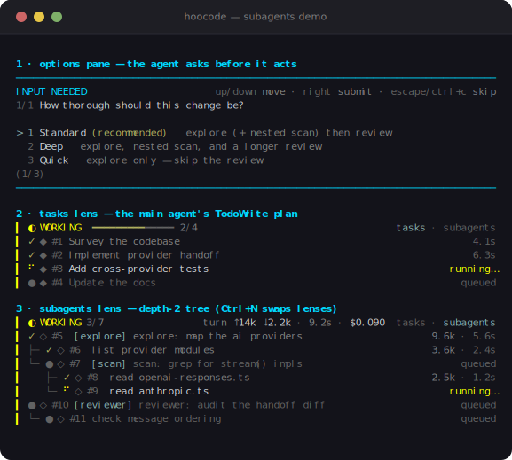

# HooCode agent-level demos

Four runnable demos that exercise the **real** agent stack — the `Agent` runtime,
the unified `ai` provider layer, and HooCode's mode/permission and resource-tree
internals. They are built entirely from the actual exports (imported the same way
the source imports them); no component is copied or reimplemented. Anything that
would need the network or real credentials uses the built-in **faux provider**, so
every demo runs offline and deterministically.

Two demos sharpen the contrast with **Claude Code**; two justify the fork against
upstream **pi**.

| Demo | Differentiates vs | Showcases | Run |
| --- | --- | --- | --- |
| `provider-handoff.ts` | Claude Code | One conversation spanning **two providers** — Anthropic drafts + calls a tool, OpenAI continues from the full history. Claude Code is single-vendor. | `npm run demo:provider-handoff` |
| `deterministic-gate.ts` | Claude Code | **Mode-scoped, deterministic permission gate** via the real `Agent.beforeToolCall` hook + `mergeConfigs`/`buildSystemPrompt`. Auto-allows a read, prompts→approves an edit, **blocks** `rm -rf`. | `npm run demo:deterministic-gate` |
| `claude-subagents.ts` | pi | `loadAgentRegistry` discovers subagents from `.claude/agents`, `.agents/agents`, and `.hoocode/agents` with precedence + collision diagnostics. **Claude subagents load unchanged**; pi can't read them. | `npm run demo:claude-subagents` |
| `claude-skills.ts` | pi | `loadSkills` reads Claude `SKILL.md` skills from `.claude/skills`, **normalizes `allowed-tools`** to HooCode names, and flags cross-tree collisions. | `npm run demo:claude-skills` |

Or run directly:

```bash
npx tsx packages/coding-agent/demo/provider-handoff.ts
npx tsx packages/coding-agent/demo/deterministic-gate.ts
npx tsx packages/coding-agent/demo/claude-subagents.ts
npx tsx packages/coding-agent/demo/claude-skills.ts
```

## Interactive UI demo

`subagents.ts` is an **interactive** demo (it takes over the terminal) built from
the real interactive-mode components — the `AskOptionsComponent` options pane and
the `TaskPanelComponent` task ledger — both fed by the real `taskStore` singleton.
It runs a scripted session: the agent asks a scoping question (options pane), lays
out a TodoWrite plan, then dispatches subagents where one subagent dispatches a
subagent of its own, so the **subagents lens shows a depth-2 tree** (◇ explore →
◇ scan). Press **Ctrl+N** to swap the pane between the **tasks** and **agents**
lenses; **Ctrl+C** exits.

Here's what it draws (no need to run it) — the three panels, rendered straight
from the real components:

<p align="center">
  
</p>

```bash
npm run demo:subagents
# or: npx tsx packages/coding-agent/demo/subagents.ts
```

> The preview above is generated from the real component output by
> `scripts/gen-subagents-svg.ts` (`npx tsx scripts/gen-subagents-svg.ts`) — it
> renders the actual components, so it always matches what the demo draws.

## Notes

- **Faux provider, real everything else.** `provider-handoff` and
  `deterministic-gate` drive the genuine `Agent` loop (tool execution, message
  handling, the `beforeToolCall` gate). Only the LLM responses are scripted via
  `registerFauxProvider`, so the demos are deterministic.
- **Hermetic.** The two interop demos build a throwaway workspace in a temp dir and
  point `HOME` at an empty temp home, so they only show the resources they create —
  they won't pick up your real `~/.claude` or `~/.hoocode` trees.
- **Tree precedence differs by resource type, on purpose.** Subagents are
  *last-wins* (a `.hoocode` agent overrides a same-named `.claude` one); skills are
  *first-wins* (the first tree loaded keeps the name). Each demo prints the actual
  winner/loser from the real diagnostics rather than asserting a direction.
- **MCP standard-config ingestion** (`~/.agents/mcp.json`, `.agents/mcp.json`,
  `~/.config/claude/mcp.json`) is the same class of pi differentiator, but its merge
  function isn't exported as a pure call (it runs inside the MCP session-start
  extension and connects to servers), so it isn't included as a standalone demo here.
